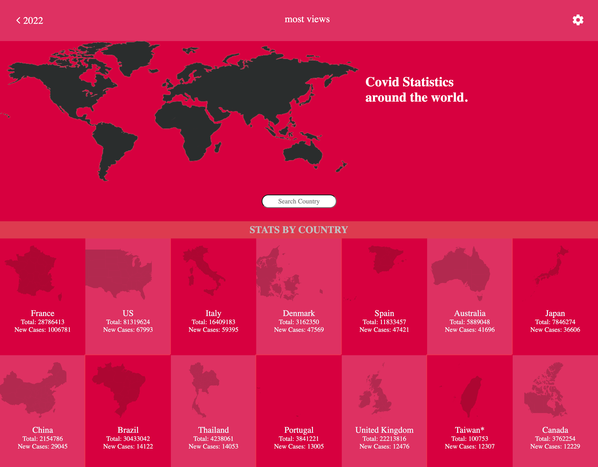
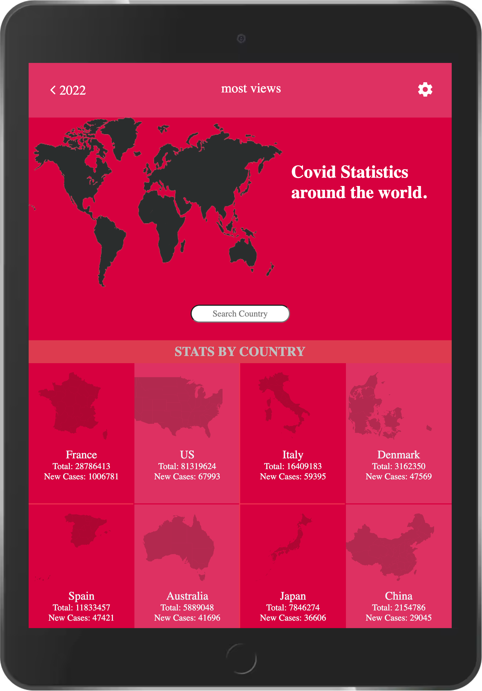
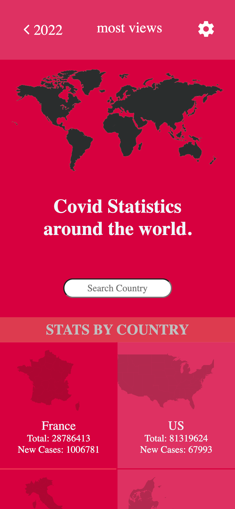

#  COVID911

> This web application fetches an API and displays live statistics about covid19 new cases in almost all countries on the planet. This Api is updated several times every day. The app makes search easy with the search bar which displays data for any country which matches the search result. It is highly responsive and looks good on any screen.

## App Visuals

## Built With

- JSX, React, Redux
- HTML, CSS, JavaScript
- npm, webpack, linters
- Jest

## Live Demo

## Getting Started

To get a local copy up and running follow these simple example steps.
for SSH:
`git clone git@github.com:carlylechia/COVID911.git`
for https:
`git clone https://github.com/carlylechia/COVID911.git`

### Install

 after cloning the repo run 
 `npm install`

### Usage
   run 
 `npm start` for devlopment
 `npm run build` for production code

### Run tests
  **Linters**
   - `npx stylelint "**/*.{css,scss}"` for CSS check.
   - `npx stylelint "**/*.{css,scss}" --fix` to auto fix CSS issues if found.
   - `npx eslint .` for JS check.
   - `npx eslint . --fix` to fix JS issues if found.
  **Jest**
    - `npm run test`

## Authors

👤 **Chia Carlyle**

- GitHub: [@CarlyleChia](https://github.com/CarlyleChia)
- Twitter: [@ChiaCarlyle](https://twitter.com/ChiaCarlyle)
- LinkedIn: [LinkedIn](https://www.linkedin.com/in/chia-carlyle/)

## 🤝 Contributing

Contributions, issues, and feature requests are welcome!

Feel free to check the [issues page](https://github.com/carlylechia/BOOKSTORE/issues).

## Show your support

Give a ⭐️ if you like this project!

## Acknowledgments

- Microverse: [microverse community](https://github.com/microverseinc)

## 📝 License

This project is [MIT](./MIT.md) licensed.